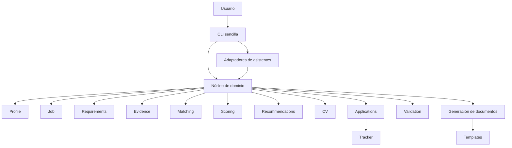

# ARCHITECTURE 00: Propuesta de arquitectura del MVP

## 1. Propósito

El objetivo del nuevo sistema es construir un MVP de búsqueda de empleo que sea universal, explicable, local y compatible con distintos asistentes de IA. A diferencia del Career-Ops actual, que mezcla prompts, scripts y documentación específica de asistentes, el nuevo sistema separa el núcleo de negocio de los prompts y de las interfaces, establece un modelo de datos universal y crea un flujo reproducible y auditado para evaluación, matching y seguimiento.

## 2. Principios de arquitectura

- Núcleo independiente del asistente: la lógica de negocio debe vivir fuera de cualquier adaptador o prompt.
- Modelo de datos universal: un esquema común para perfil, oferta, requisitos, evidencia y aplicaciones.
- Privacidad local: los datos de usuario se mantienen en local y no son obligatoriamente enviados a servicios externos.
- Scoring reproducible: los resultados deben derivarse de reglas y cálculos deterministas siempre que sea posible.
- Trazabilidad requisito-evidencia: cada recomendación debe enlazar requisitos de la oferta con la evidencia usada.
- Revisión humana: el sistema sugiere y documenta, pero no envía ni acepta sin validación humana.
- No inventar información: no se debe generar ni ampliar experiencia que no esté respaldada por el CV o las pruebas proporcionadas.
- Interfaces sustituibles: la arquitectura debe permitir cambiar CLI por conversación o futuro web sin rehacer el núcleo.
- Compatibilidad progresiva con Career-Ops: reutilizar lo que tiene sentido y soportar la migración desde el repositorio actual.
- Facilidad de uso para personas no técnicas: favorecer flujos guiados, importación simple y un tracker básico claro.

## 3. Capas del sistema

1. Datos y configuración del usuario
   - Almacena perfil, objetivos laborales, preferencias, CV y tracker.
   - Debe ser local, estructurado y extensible.
2. Importación y normalización
   - Convierte `cv.md` y ofertas en estructuras internas uniformes.
   - Normaliza campos de oferta y CV para que el núcleo pueda trabajar con ellos.
3. Núcleo de dominio
   - Contiene el modelo universal y las reglas de negocio.
   - Define `profile`, `job`, `requirement`, `evidence`, `application` y validaciones.
4. Motor de evaluación
   - Ejecuta matching, scoring, identificación de carencias y confianza.
   - Devuelve recomendaciones explicadas.
5. Generación de documentos
   - Produce CV adaptado, cartas y PDFs a partir de plantillas.
   - Registra qué evidencia se usó y qué afirmaciones se incluyeron.
6. Tracker
   - Mantiene el estado de las postulaciónes, scores, confianza, fechas y acciones.
   - Sirve de base para seguimiento y futuros análisis.
7. Adaptadores de asistentes
   - Interfazan con Codex, Claude, OpenCode, Qwen, Gemini y un adaptador genérico.
   - Deben traducir comandos y resultados, sin contener lógica de negocio.
8. Interfaces de usuario
   - Implementan CLI, assistants y futura web.
   - Consumen el núcleo y los adaptadores, y no deben ser responsables del scoring.

## 4. Módulos del núcleo

- `profile`
  - Responsabilidad: modelar el perfil del candidato y sus objetivos.
  - Entradas: datos importados del CV, preferencias del usuario, objetivos laborales.
  - Salidas: perfil universal validado, metas claras y parámetros de búsqueda.
- `evidence`
  - Responsabilidad: representar unidades de evidencia extraídas del CV.
  - Entradas: fragmentos del CV, proyectos, métricas, habilidades.
  - Salidas: evidencias estructuradas con tipo, nivel y contexto.
- `job`
  - Responsabilidad: representar ofertas normalizadas.
  - Entradas: texto de oferta, URL, campos de empleo, datos de empresa.
  - Salidas: oferta estructurada con título, responsabilidades, requisitos y condiciones.
- `requirements`
  - Responsabilidad: clasificar y normalizar requisitos de la oferta.
  - Entradas: oferta normalizada, documentación del JD.
  - Salidas: lista de requisitos con tipo, prioridad y etiquetas.
- `matching`
  - Responsabilidad: emparejar requisitos con evidencias del candidato.
  - Entradas: requisitos y evidencias.
  - Salidas: coincidencias, grados de match y carencias identificadas.
- `scoring`
  - Responsabilidad: calcular valores reproducibles de fit y recomendación.
  - Entradas: coincidencias, pesos, competencia, confianza.
  - Salidas: score numérico, niveles de recomendación y explicaciones.
- `recommendations`
  - Responsabilidad: producir consejos de aplicación, adaptación de CV y siguiente acción.
  - Entradas: resultado de scoring, perfil, oferta y carencias.
  - Salidas: recomendaciones claras, prioridad de acciones y notas.
- `cv`
  - Responsabilidad: gestionar el CV del usuario y su adaptación.
  - Entradas: CV importado, evidencia seleccionada, objetivos.
  - Salidas: CV personalizado listo para exportar y registro de cambios.
- `applications`
  - Responsabilidad: mantener el tracker básico de candidaturas.
  - Entradas: oferta, score, confianza, estado, fechas, notas.
  - Salidas: registro histórico y acciones pendientes.
- `validation`
  - Responsabilidad: verificar consistencia, formatos y requisitos mínimos.
  - Entradas: perfil, CV, oferta, tracker.
  - Salidas: errores, advertencias y validaciones de integridad.

## 5. Separación entre lógica y prompts

- Qué debe trasladarse desde `modes/_shared.md`:
  - Reglas de ética, revisión humana, no inventar experiencia, estados canónicos y políticas de uso.
  - Definición de arquetipos de oferta como guía, no como cálculo.
- Qué debe mantenerse como instrucción para el asistente:
  - Formato de salida para conversaciones.
  - Explicaciones en lenguaje natural y pasos sugeridos para el usuario.
  - Tareas de lectura de texto libre que son aún más eficientes con LLM.
- Qué debe convertirse en reglas deterministas:
  - La fórmula de scoring, normalización de requisitos, identificación de carencias y confianza.
  - La correspondencia requisito-evidencia básica y la validación de datos.
- Qué puede continuar dependiendo del razonamiento del modelo:
  - La redacción de recomendaciones, el resumen del fit y la generación de texto adaptado siempre que se base en evidencia validada.

## 6. Modelo requisito-evidencia

- Requisito: una necesidad declarada por la oferta, como experiencia en un área, habilidad o responsabilidad.
- Evidencia: un fragmento del CV que demuestra capacidad o logro relacionado con un requisito.
- Nivel de coincidencia: qué tan bien la evidencia cubre el requisito (alto, medio, bajo).
- Confianza: grado de certeza de la coincidencia con base en datos estructurados y texto.
- Carencia: requisito sin evidencia suficiente en el perfil.
- Competencia transferible: evidencia relevante de otra área que puede compensar una carencia directa.
- Dato no verificado: una afirmación que no se puede confirmar automáticamente con el CV y requiere revisión humana.
- Afirmación prohibida: cualquier conclusión que amplíe experiencia más allá de lo documentado.

Ejemplo genérico:
- Requisito: "liderar equipos remotos".
- Evidencia: "coordinar proyectos globales con equipos de 12 personas".
- Nivel de coincidencia: alto si coincide en liderazgo y alcance remoto, medio si sólo hay coordinación de equipos locales.
- Confianza: alta si el CV menciona explícitamente "equipos remotos" y rol de liderazgo.
- Carencia: si el CV no menciona equipo remoto ni liderazgo.
- Competencia transferible: experiencia en coordinación de múltiples proyectos internacionales.
- Dato no verificado: "fuerte capacidad de liderazgo" no conectada a una métrica o ejemplo concreto.
- Afirmación prohibida: "líder de ingeniería" si el CV no lo respalda.

## 7. Motor de scoring

Flujo reproducible propuesto:
1. Normalizar la oferta: convertir la oferta en un objeto estructurado de `job` y `requirements`.
2. Clasificar requisitos: asignar tipos y prioridades a cada requisito.
3. Encontrar evidencias: buscar en `evidence` coincidencias con requisitos.
4. Calcular coincidencias: determinar nivel de match y si se requiere competencia transferible.
5. Identificar carencias: detectar requisitos insuficientes o no cubiertos.
6. Aplicar pesos: usar reglas parametrizables para combinar coincidencias, carencias y confianza.
7. Calcular confianza: estimar la solidez del resultado según la calidad de la evidencia.
8. Producir recomendación: generar un score y un nivel de acción (aplicar, revisar, descartar).
9. Explicar el resultado: producir una narrativa estructurada con requisito-evidencia y carencias.

No se fijan pesos definitivos; el diseño debe permitir ajustes sin rehacer la arquitectura.

## 8. Adaptadores de asistentes

Interfaz común propuesta:
- `parseCommand(input)` → interpretar intención del usuario.
- `renderResponse(output)` → convertir estructura del núcleo en texto/JSON para el asistente.
- `handleSession(state, input)` → gestionar estado de conversación si aplica.
- `supportsCapabilities(capabilities)` → declarar qué ofrece el asistente.

Adaptadores específicos:
- Codex: entrada de texto libre y respuestas estructuradas.
- Claude: skill con enrutador de modos y prompts de salida.
- OpenCode: skill basada en el mismo enrutador de modos.
- Qwen: skill similar con prompt adaptado.
- Gemini: integración de API y manejo de comandos.
- Adaptador genérico: receptor de texto y productor de JSON/lenguaje.

Clarificación: los adaptadores no deben contener el motor de negocio. Su única responsabilidad es traducir entre el asistente y el núcleo.

## 9. Interfaces de usuario

Niveles propuestos:
- CLI sencilla: entrada de comandos básica, flujos guiados y salida estructurada.
- Conversación con asistente: interacción a través de prompts y respuestas naturales.
- Interfaz web local futura: UI accesible que consuma el núcleo desde el navegador.

MVP: la CLI sencilla es la interfaz principal del MVP. La conversación con asistente se soporta como adaptador pero no es la experiencia base, y la interfaz web queda para fases posteriores.

## 10. Flujo de onboarding

1. Iniciar configuración: ejecutar un comando que revise el entorno.
2. Importar CV: cargar `cv.md` o un equivalente inicial.
3. Extraer datos: parsear el CV y generar evidencias estructuradas.
4. Validar con el usuario: mostrar extracción y permitir correcciones.
5. Definir objetivos: preguntar roles deseados, ubicaciones y prioridades.
6. Registrar preferencias: guardar modalidad, nivel, compensación y restricciones.
7. Crear perfil: construir el perfil universal validado.
8. Añadir evidencias: permitir al usuario confirmar o agregar evidencia manualmente.
9. Comprobar inconsistencias: alertar sobre datos faltantes, carencias y formatos inválidos.
10. Analizar primera oferta: procesar una oferta de prueba y proporcionar la primera recomendación.

## 11. Flujo de análisis de una oferta

1. Usuario pega URL o texto de la oferta.
2. El sistema normaliza la oferta y extrae requisitos.
3. El núcleo clasifica los requisitos y asigna prioridad.
4. El motor busca evidencias en el perfil y calcula coincidencias.
5. Se identifican carencias y competencias transferibles.
6. Se calcula el score y la confianza.
7. Se genera una recomendación explicada y tareas sugeridas.
8. El usuario revisa el resultado y decide la acción siguiente.

## 12. Flujo de generación de CV

1. Selección de evidencia relevante: elegir evidencias que coincidan con la oferta.
2. Adaptación de resumen: ajustar el resumen para reflejar objetivos y fit.
3. Palabras clave: destacar términos de la oferta sin inventar habilidades.
4. Control de afirmaciones: asegurar que cada frase tiene respaldo en la evidencia.
5. Registro de contenido incluido: documentar qué evidencias se usaron y por qué.
6. Exportación: generar PDF a partir de plantillas.
7. Revisión humana: el usuario valida el CV adaptado antes de usarlo.

## 13. Flujo del tracker

El tracker básico debe contener:
- Oferta: título y URL.
- Empresa: nombre y sector.
- Puntuación: score calculado.
- Confianza: nivel de robustez del resultado.
- Estado: evaluado, aplicado, pendiente, descartado.
- CV utilizado: perfil o versión de CV adaptado.
- Fechas: evaluación, aplicación, seguimiento.
- Siguiente acción: llamada a la acción clara.
- Observaciones: notas de usuario y carencias.

## 14. Compatibilidad con el sistema original

- Formatos importables:
  - `cv.md` y `config/profile.yml` pueden importarse como datos iniciales.
  - `data/applications.md` y `reports/` pueden usarse como base histórica.
- Scripts reutilizables:
  - `generate-pdf.mjs` y templates pueden reintegrarse.
  - `check-liveness.mjs`, `providers/` y tracker scripts pueden ser compatibles como capa heredada.
- Elementos de capa heredada:
  - `.claude/`, `.opencode/`, `.qwen/` y documentación de asistentes pueden mantenerse como compatibilidad mientras se implementa un adaptador común.
- Inicialmente incompatibles:
  - `modes/oferta.md` y `modes/_shared.md` como fuente principal de scoring.
  - `batch/` y escaneo masivo si no se incluye en MVP.
  - Dashboard TUI si el MVP no lo utiliza como interfaz principal.

## 15. Estructura de carpetas propuesta

- `src/`
  - `core/`
  - `schemas/`
  - `services/`
  - `adapters/`
  - `interfaces/`
- `config/`
- `data/`
- `templates/`
- `tests/`
- `docs/`

## 16. Alcance exacto del MVP

Incluye únicamente:
- onboarding guiado;
- perfil universal;
- importación inicial de CV;
- normalización de oferta;
- matching requisito-evidencia;
- scoring reproducible;
- recomendación explicada;
- CV adaptado;
- PDF;
- tracker básico;
- adaptador inicial de Codex;
- CLI sencilla;
- pruebas.

## 17. Fuera del MVP

No incluye:
- aplicación automática;
- escaneo masivo;
- interfaz web;
- aplicación móvil;
- múltiples usuarios;
- nube;
- integración directa con LinkedIn;
- IA entrenada específicamente;
- análisis avanzado de rechazos.

## 18. Dependencias entre módulos

## 19. Riesgos arquitectónicos

- Sobreingeniería: diseñar una arquitectura demasiado compleja antes de validar el MVP.
- Duplicación: mantener prompts y lógica idéntica en múltiples capas.
- Acoplamiento a modelos de IA: depender de un asistente para el scoring en lugar de un núcleo independiente.
- Resultados no reproducibles: si el scoring sigue dependiendo del razonamiento del modelo.
- Privacidad: exponer datos de usuario a servicios externos sin control.
- Migración: perder compatibilidad con Career-Ops si no se gestiona la capa heredada.
- Compatibilidad: no integrar correctamente adaptadores antiguos y nuevos.
- Complejidad del onboarding: un flujo inicial demasiado técnico limita la adopción.

## 20. Decisiones todavía abiertas

- Si la CLI debe ser el único MVP o si la conversación con asistente también entra desde el inicio.
- Cómo estructurar exactamente el perfil universal sin duplicar datos entre `config/profile.yml` y `_profile.md`.
- Qué grado de automatización permitir en la generación de CV dentro del MVP.
- Si el motor de scoring debe ser completamente determinista o híbrido con validación LLM.
- Cómo importar formatos adicionales de CV más allá de Markdown en el MVP.
- Qué nivel de compatibilidad con `providers/` y `check-liveness.mjs` es aceptable para la primera versión.
